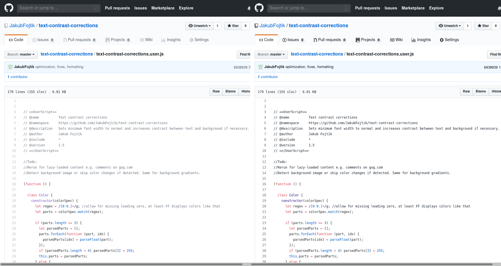

# Description

Sets minimum font width to normal and increases contrast between text and background if 
necessary.
Also changes scrollbar colors to dark on transparent.

Only tested in Greaasemonkey in Firefox.

# Example
Not very visible, but the Issues, Pull requests etc. have more contrast, as do the comments:

# Installation

 - Install Greasemonkey or equivalent
 - open the [text-contrast-corrections.user.js](https://github.com/JakubFojtik/text-contrast-corrections/raw/master/text-contrast-corrections.user.js) in browser and accept install prompt from 
Greasemonkey
 - if no install prompt appears, click GM logo, Add new script, then Edit the new script and copy 
the contents of [text-contrast-corrections.user.js](https://github.com/JakubFojtik/text-contrast-corrections/raw/master/text-contrast-corrections.user.js) there

# Configuration

Script hijacks the page http://example.com, and replaces it with configuration for the desired contrast ratio.
So you can set ratio of 1 (100%) to make all text black (or white on dark backgrounds), or 0.5 (50%) to make almost no change to pages.

# Todos

 - does not yet run on lazy-loaded content universaly, only with specific hacks for e.g. GitHub
 - does not choose contrasting colors, just opposite brightness
